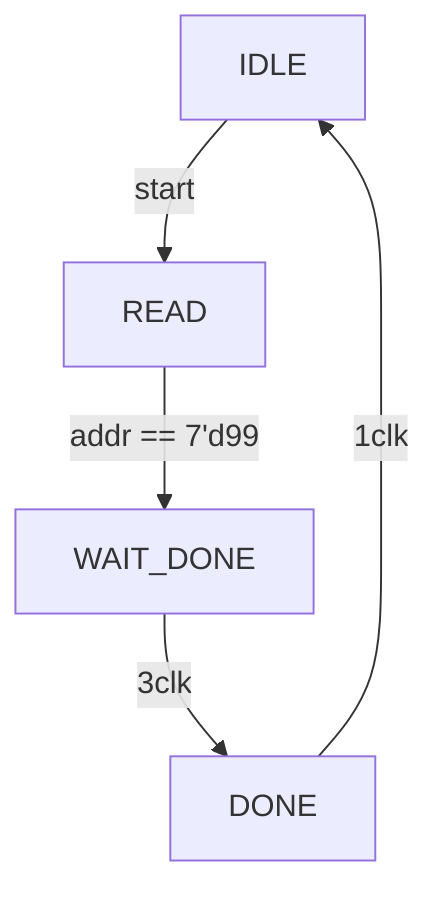
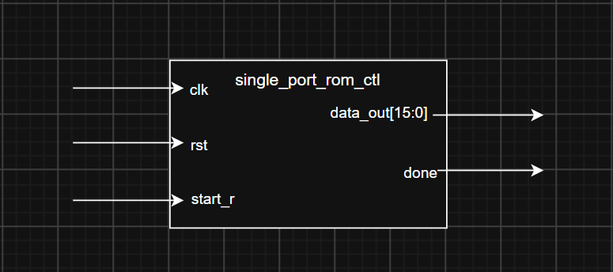
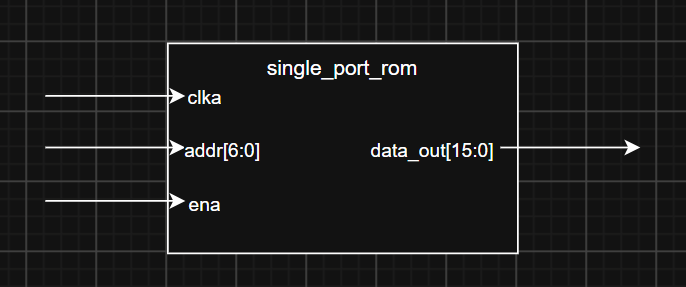
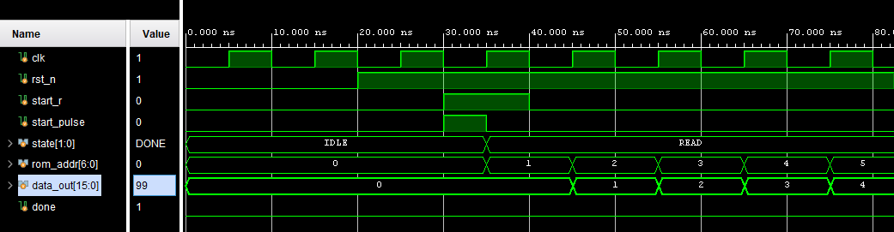
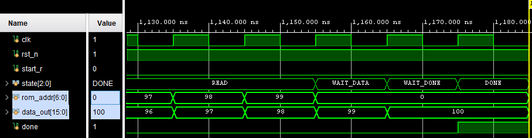
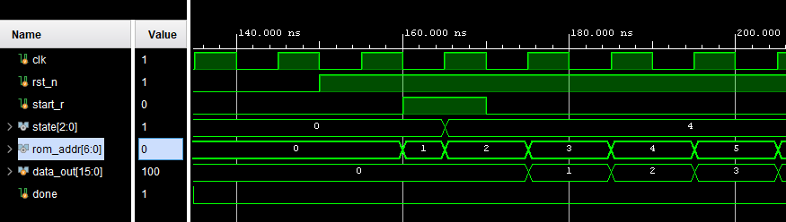
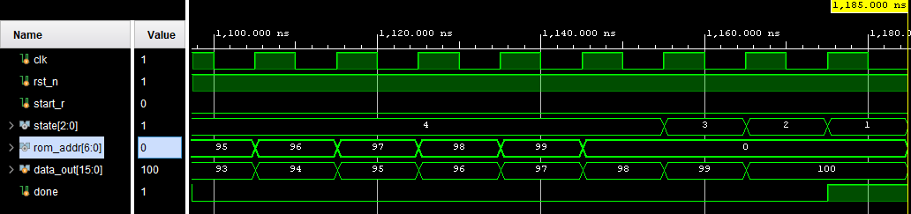
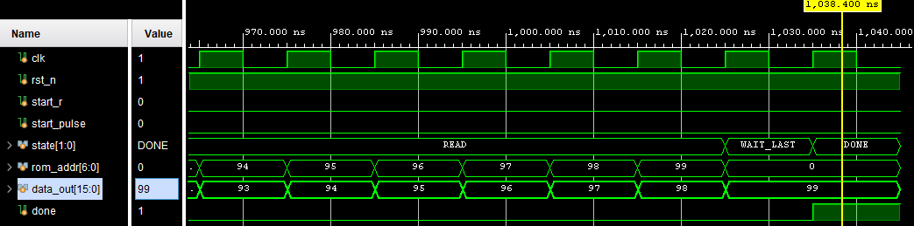

# Single Port Rom Project
SangJae Park
2026-07-27

## Overview
- instance single port rom & read data
- this is ETRI W6 DAY 1 ASSIGNMENT1.

## Features
- addr != data_out

## Constraints
- read delay is 2 clk
- addr is 0 to 99
- data file is saved by mem.coe(1 to 100)

## Interface
```sv
        input   logic               clk
    ,   input   logic               rst_n
    ,   input   logic               start_r
    ,   output  logic [15:0]        data_out
    ,   output  logic               done
```
## Registers
```sv
    logic               rom_en;
    logic [6:0]         rom_addr;
```
## timing diagram
### reset part & start part
```wavedrom
{head: { text: "reset & start" }
,   signal : [
    ['input'
    ,   {name : "clk",      wave : "P......."}
    ,   {name : "rst_n",    wave : "0.1....."}
    ,   {name : "start_r",  wave : "0..10..."}
    ],
    ['reg'
    ,   {name : "addr",     wave : "x..=====", data : ["0","1","2","3","4"]}
    ]
    ,   {name : "STATE",    wave : "3..4....", data : ["IDLE","READ"]}
,   ['output'    
    ,   {name : "data_out", wave : "...=====", data : ["0","1","2","3"]}
    ,   {name : "done",     wave : "0......."}
    ]
]
}
```
### done part
```wavedrom
{head: { text: "done part" }
,   signal : [
    ['input'
    ,   {name : "clk",      wave : "P......."}
    ,   {name : "rst_n",    wave : "1......."}
    ,   {name : "start_r",  wave : "0......."}
    ],
    ['reg'
    ,   {name : "addr",     wave : "====x...", data : ["96","97","98","99"]}
    ]
    ,   {name : "STATE",    wave : "4...567x", data : ["READ","WAIT_DATA","WAIT_DONE","DONE"]}
,   ['output'    
    ,   {name : "data_out", wave : "======x.", data : ["95","96","97","98","99","100"]}
    ,   {name : "done",     wave : "0.....10"}
    ]
]
}
```
## STATE DIAGRAM
state에 분기가 없어서 1-process 방식 사용


## Block diagram
bd_single_port_rom_ctl

bd_single_port_rom

## ROM if
```sv
blk_mem_gen_0 u_blk_mem_gen_0 (
    .clka   (clk),
    .ena    (rom_en),
    .addra  (rom_addr),
    .douta  (data_out)
);
```

## Test
### Test scenario
1. repeat(15) @posedge clk; // po sim때문에 10클럭 넘기고 수행
2. reset
3. start
4. wait(done)

### be_sim



### po_sim




## Trouble shooting

문제 : be_sim의 Done 부분과 timing diagram이 다른 결과를 가진다
1. be_sim에서 WAIT_DONE이 1CLK 만 유지가 되고 있음 => Addr(99)가 데이터를 가져오지 못함

이유 :  
1. TIMING DIAGRAM 잘못그려서 RTL 설계를 실수함
2. WAIT_DONE을 2CLK 유지 시키지 않았음

해결방법 고민
1. state 하나 추가 => WAIT_DATA 를 WAIT_DONE 앞에 추가하여 EN 할당
=> 예상 결과 : `f/f 1개 증가`, `comb 회로 증가`(en에 추가로 넣어야함/이것이 cp일까는 고민)

2. BLOCK MEM gen에서 `Primitives Output Register`를 해제하면 output reg에 en이 연동되지 않는다.(아예 레지스터가 되지않는다) + WAIT DATA 1CLK 연장시키기
=> 예상 결과 : reg 하나만 더 사용

3. `primitives Output Reg`를 해제하고 state 하나 추가.(원핫으로도/[2:0]으로도)
=> 예상 결과 : reg 하나만 더 사용

해결
state 추가하고 출력 레지스터는 그대로 유지하며 enable 회로는 추가한다.

근거 : 타이밍 확보에는 출력레지스터 유지가 낫다. FPGA 상에서는 mem내부의 reg를 사용하는 것이 더 wire길이가 짧다. 또한 enable 회로가 증가하는 것에 대하여 critical path 또한 아니다.