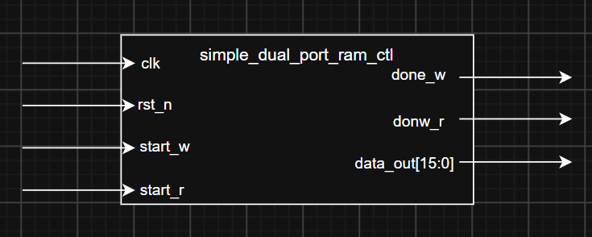
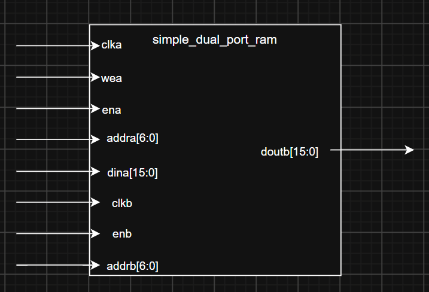
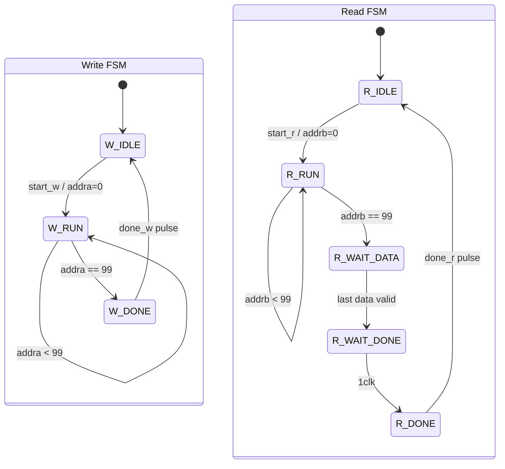
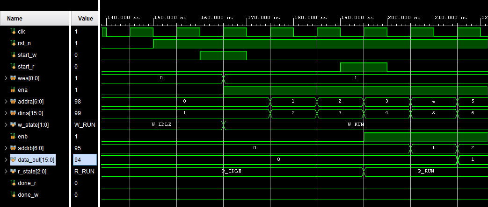
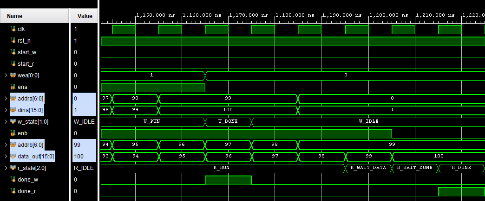
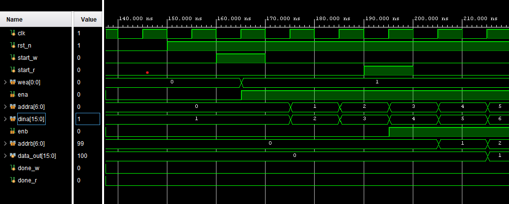
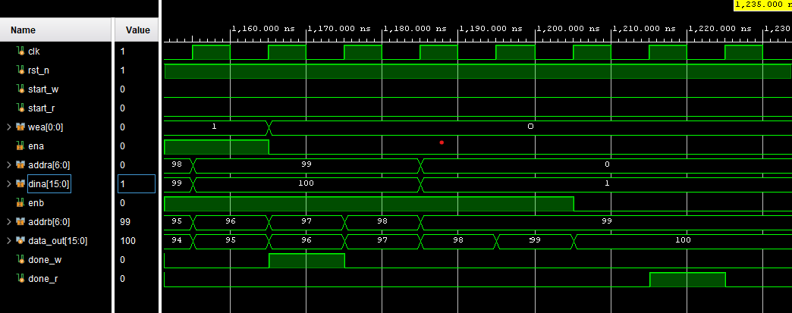

# Simple dual port ram
SangJae Park
2026-07-28

## Overview
- instance simple dual port ram & read data
- this is ETRI W6 DAY 2 ASSIGNMENT2.

## Features


## Constraints
- read delay is 2 clk cycles
- addr is 0 to 99
- data input is interner register and the data is 1 to 100

- reset is async active low
- done_w is 1 clk pulse after WRITE
- done_r is 1 clk pulse after READ
## Interface
```sv
        input   logic               clk
    ,   input   logic               rst_n
    ,   input   logic               start_w
    ,   input   logic               start_r

    ,   output  logic [15:0]        data_out
    ,   output  logic               done_w
    ,   output  logic               done_r
```

## Block diagram
### bd_top

s
### bd_simple_port_ram


## Registers
```sv
logic [15:0]            data_in;
logic [6:0]             addra;
logic [6:0]             addrb;
logic                   wea;
logic                   ena;
logic                   enb;
```

## RAM if
port A : addra + dina + wea + ena (1clk cycle hold)=> write
port B : addrb +              enb (2clk cycle hold)=> read
- primitives output register
```sv
blk_mem_gen_0 u_blk_mem_gen_0 (
    .clka   (clk),
    .wea    (wea),
    .ena    (ena),
    .addra  (addra),
    .dina   (data_in),
    .clkb   (clk),
    .enb    (enb),
    .addrb  (addrb),
    .doutb  (data_out)
);
```

## timing diagram
### WRITE READ START
```wavedrom
{head: { text: "write&read_start" }
,   signal : [
    ['input'
    ,   {name : "clk",     wave : "P......."}
    ,   {name : "start_w",   wave : "010....."}
    ,   {name : "start_r",   wave : "0...10.."}
    ]
  	,	{}
    ,['mem'
    ,   {name : "clka",    wave : "P......."}
    ,   {name : "wea",     wave : "x01....."}
    ,   {name : "ena",     wave : "x01....."}
    ,   {name : "addra",   wave : "x.======", data : ["0","1","2","3","4","5"]}
    ,   {name : "dina",    wave : "x.======", data : ["1","2","3","4","5","6"]}
      
    ,   {name : "clkb",    wave : "P......."}
    ,   {name : "enb",     wave : "x0...1.."}
    ,   {name : "addrb",   wave : "x....===", data : ["0","1","2","3","4","5"]}
    ,   {name : "doutb",   wave : "x......=", data : ["1","2","3","4","5","6"]}
    ]
  	,	{}
,   ['output'    
    ,   {name : "data_out",wave : "x......=", data : ["1","2","3","4","5","6"]}
    ,   {name : "done_r",  wave : "0......."}
    ,   {name : "done_w",  wave : "0......."}
    ]
]
}
```
### WRITE READ DONE
```wavedrom
{head: { text: "WRITE&READ DONE" }
,   signal : [
    ['input'
    ,   {name : "clk",     wave : "P......."}
    ,   {name : "start_w",   wave : "0......."}
    ,   {name : "start_r",   wave : "0......."}
    ]
  	,	{}
    ,['mem'
    ,   {name : "clka",    wave : "P......."}
    ,   {name : "wea",     wave : "1.0....."}
    ,   {name : "ena",     wave : "1.0....."}
    ,   {name : "addra",   wave : "==......", data : ["98",99,"2","3","4","5"]}
    ,   {name : "dina",    wave : "==......", data : ["99","100","3","4","5","6"]}
      
    ,   {name : "clkb",    wave : "P......."}
    ,   {name : "enb",     wave : "1......0"}
    ,   {name : "addrb",   wave : "=====...", data : ["95","96","97","98","99","100"]}
    ,   {name : "doutb",   wave : "=======.", data : ["94","95","96","97","98","99","100"]}
    ]
  	,	{}
,   ['output'    
    ,   {name : "data_out",wave : "=======.", data : ["94","95","96","97","98","99","100"]}
    ,   {name : "done_r",  wave : "0......1"}
    ,   {name : "done_w",  wave : "0..10..."}
    ]
]
}
```

## STATE DIAGRAM
  Write FSM: W_IDLE → W_RUN → W_DONE → W_IDLE
  Read  FSM: R_IDLE → R_RUN → R_WAIT_DATA → R_WAIT_DONE → R_DONE → R_IDLE

  Write FSM:
- W_IDLE: ena=0, wea=0, done_w=0
- start_w 수신: addra=0, data_in=1
- W_RUN: 매 클록 주소와 데이터를 증가시키며 기록
- addra==99가 기록된 다음 W_DONE
- W_DONE: done_w=1을 한 클록 출력

Read FSM:
- R_IDLE: enb=0, done_r=0
- start_r 수신: addrb=0
- R_RUN: enb=1, 주소 0→99 순차 입력
- addrb==99가 입력되면 R_WAIT_DATA
- R_WAIT_DATA: addrb=99, enb=1을 한 클록 더 유지해서 마지막 데이터가 출력 레지스터까지 도착하도록 함
- R_WAIT_DONE: 한클럭 더 유지해서 DONE값을 미룸 1CLK 뒤에 R_DONE
- R_DONE: enb=0, done_r=1을 한 클록 출력




## Test
### Test scenario
1. repeat(15) @posedge clk; // po sim때문에 10클럭 넘기고 수행
2. reset
3. start
4. wait(done)

### be_sim
#### be_sim_write_read_start

---
#### be_sim_write_read_done

---

### po_sim
#### po_sim_write_read_start

---
#### po_sim_write_read_done

---

## Trouble shooting
문제 1. `done_r 신호가 timing diagram 에 비해 1 clk 빨리 나옴`

원인 : `R_WAIT_DATA`로는 en을 조절할 수 있지만 그것으로 `R_DONE`의 타이밍을 담보하지 못했음

해결 : STATE를 하나 추가하였음. `R_WAIT_DONE`. REG하나 추가로 `R_DONE`의 타이밍을 맞췄다.