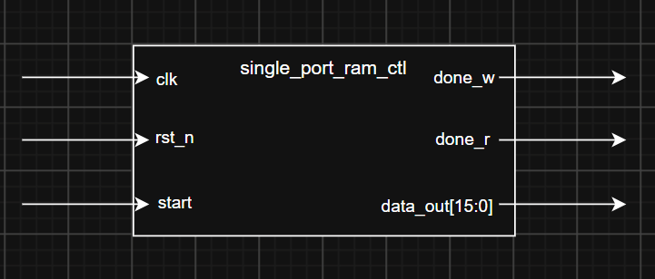
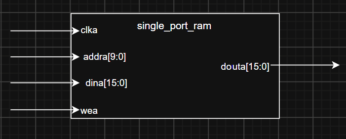
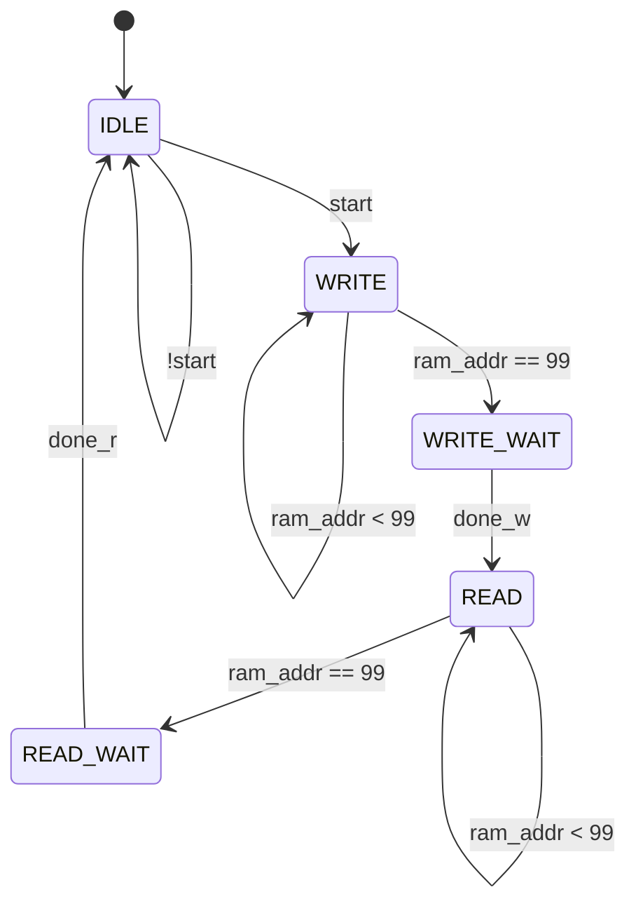
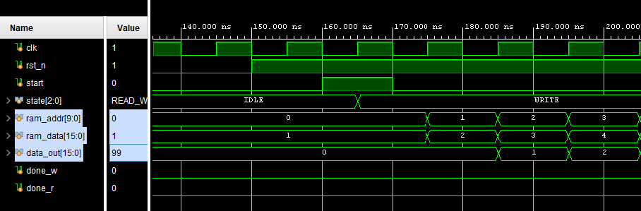
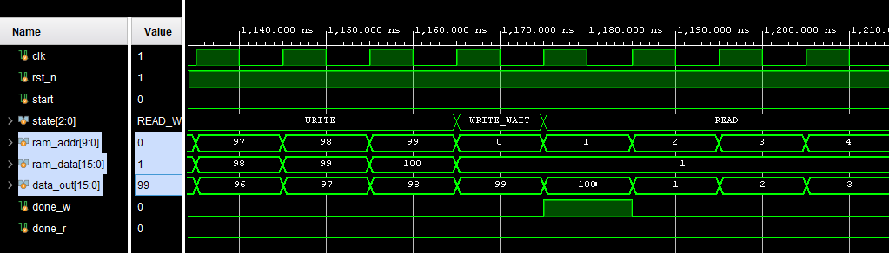
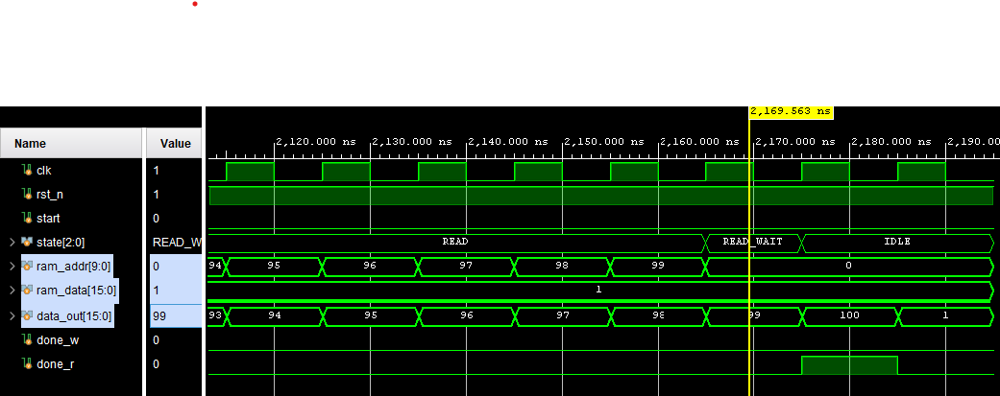
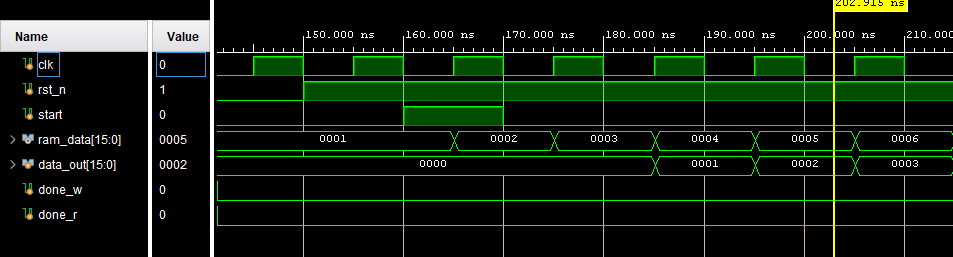
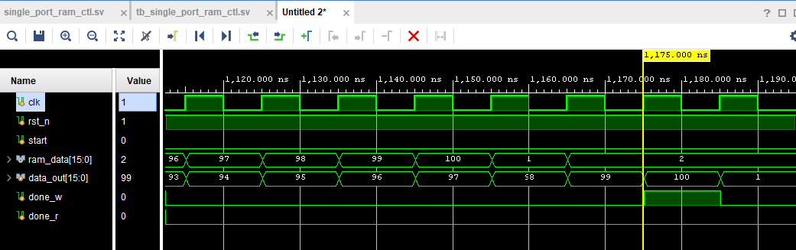
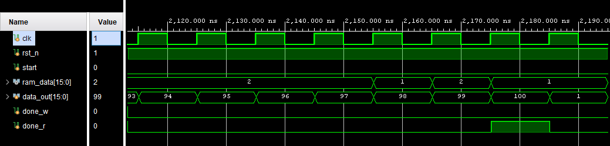

# Single Port Ram Project
SangJae Park
2026-07-28

## Overview
- instance single port ram & read data
- this is ETRI W6 DAY 2 ASSIGNMENT1.

## Features


## Constraints
- read delay is 2 clk cycles
- addr is 0 to 99
- data input is interner register and the data is 1 to 100

- reset is async active low

## Interface
```sv
        input   logic               clk
    ,   input   logic               rst_n
    ,   input   logic               start

    ,   output  logic [15:0]        data_out
    ,   output  logic               done_w // 1clk pulse when write done
    ,   output  logic               done_r // 1clk pulse when read done
```

## Block diagram
### bd_top


### bd_single_port_ram


## Registers
```sv
logic [15:0]            ram_data;
logic [9:0]             ram_addr;
```

## RAM if
```sv
blk_mem_gen_0 u_blk_mem_gen_0 (
    .clka   (clk),
    .wea    (ram_we),
    .addra  (ram_addr),
    .dina   (ram_data),
    .douta  (data_out)
);
```
## timing diagram
### WRITE START
```wavedrom
{head: { text: "write_start" }
,   signal : [
    ['input'
    ,   {name : "clk",     wave : "P......."}
    ,   {name : "rst_n",   wave : "01......"}
    ,   {name : "start",   wave : "0.10...."}
    ]
  	,	{}
    ,['mem'
    ,   {name : "clka",    wave : "P......."}
    ,   {name : "wea",     wave : "x0.1...."}
    ,   {name : "addra",   wave : "x..=====", data : ["0","1","2","3","4"]}
    ,   {name : "dina",    wave : "x..=====", data : ["1","2","3","4","5"]}
    ,   {name : "douta",   wave : "x....===", data : ["1","2","3"]}
    ]
  	,	{}
    ,   {name : "STATE",   wave : "3..4....", data : ["IDLE","WRITE"]}
,   ['output'    
    ,   {name : "data_out",wave : "x....===", data : ["1","2","3"]}
    ,   {name : "done_r",  wave : "0......."}
    ,   {name : "done_w",  wave : "0......."}
    ]
]
}
```
### WRITE READ
```wavedrom
{head: { text: "WRITE_READ" }
,   signal : [
    ['input'
    ,   {name : "clk",     wave : "P......."}
    ,   {name : "rst_n",   wave : "1......."}
    ,   {name : "start",   wave : "0......."}
    ]
  	,	{}
    ,['mem'
    ,   {name : "clka",    wave : "P......."}
    ,   {name : "wea",     wave : "1..0...."}
    ,   {name : "addra",   wave : "========", data : ["98","99","0","1","2","3","4","5"]}
    ,   {name : "dina",    wave : "==......", data : ["99","100"]}
    ,   {name : "douta",   wave : "========", data : ["97","98","99","100","1","2","3","4",]}
    ]
  	,	{}
    ,   {name : "STATE",   wave : "4.56....", data : ["WRITE","WW","READ"]}
,   ['output'    
    ,   {name : "data_out",wave : "========", data : ["97","98","99","100","1","2","3","4",]}
    ,   {name : "done_r",  wave : "0......."}
    ,   {name : "done_w",  wave : "0..10..."}
    ]
]
}
```
### READ DONE
```wavedrom
{head: { text: "READ_DONE" }
,   signal : [
    ['input'
    ,   {name : "clk",     wave : "P......."}
    ,   {name : "rst_n",   wave : "1......."}
    ,   {name : "start",   wave : "0......."}
    ]
  	,	{}
    ,['mem'
    ,   {name : "clka",    wave : "P......."}
    ,   {name : "wea",     wave : "0......."}
    ,   {name : "addra",   wave : "===.....", data : ["98","99","0","1","2","3","4","5"]}
    ,   {name : "dina",    wave : "==......", data : ["99","100"]}
    ,   {name : "douta",   wave : "====....", data : ["97","98","99","100","1","2","3","4",]}
    ]
  	,	{}
    ,   {name : "STATE",   wave : "6.76....", data : ["READ","WR","READ"]}
,   ['output'    
    ,   {name : "data_out",wave : "====....", data : ["97","98","99","100","1","2","3","4",]}
    ,   {name : "done_r",  wave : "0...10.."}
    ,   {name : "done_w",  wave : "0......."}
    ]
]
}
```
## STATE DIAGRAM



## Test
### Test scenario
1. repeat(15) @posedge clk; // po sim때문에 10클럭 넘기고 수행
2. reset
3. start
4. wait(done)

### be_sim
#### be_sim_write_start

---
#### be_sim_write_read

---
#### be_sim_read_end

---

### po_sim
#### po_sim_write_start

---
#### po_sim_write_read

---
#### po_sim_read_end

---


## Trouble shooting
