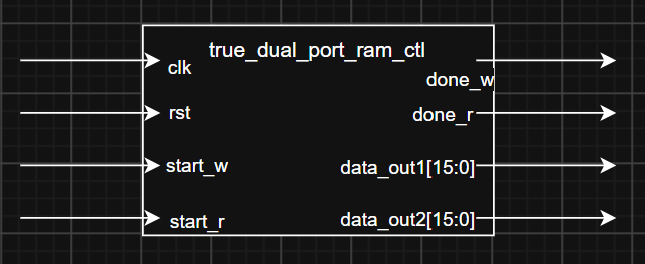
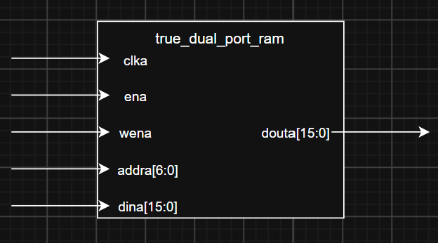
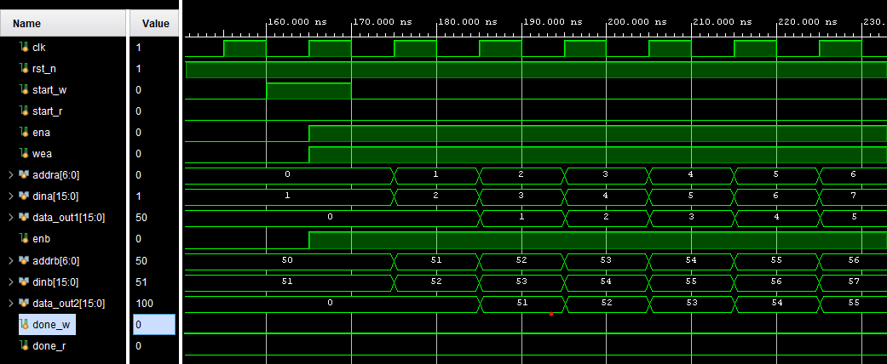
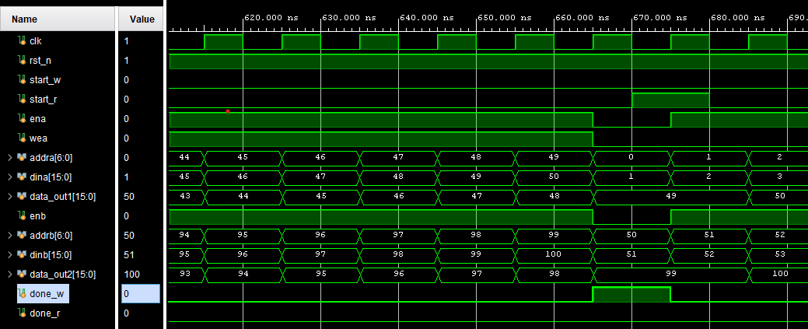
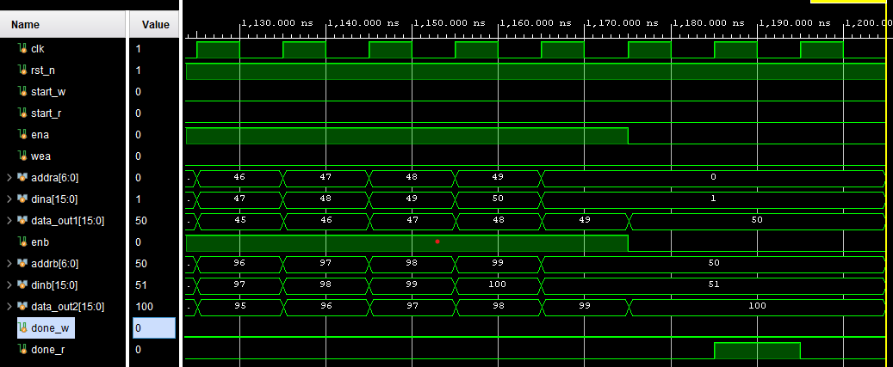
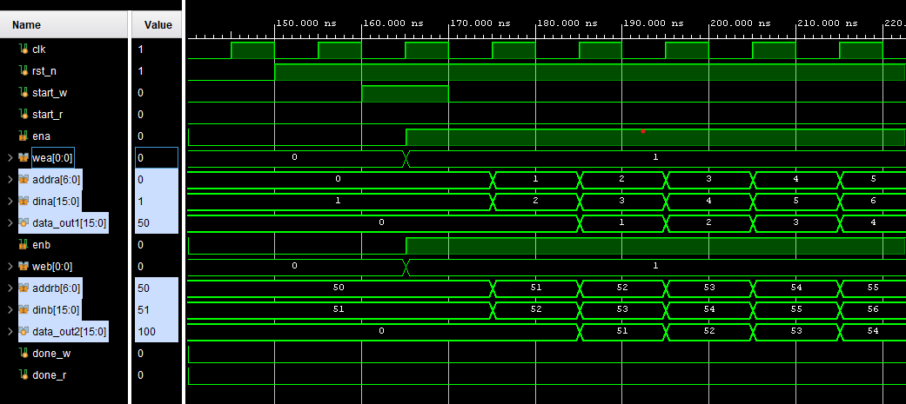
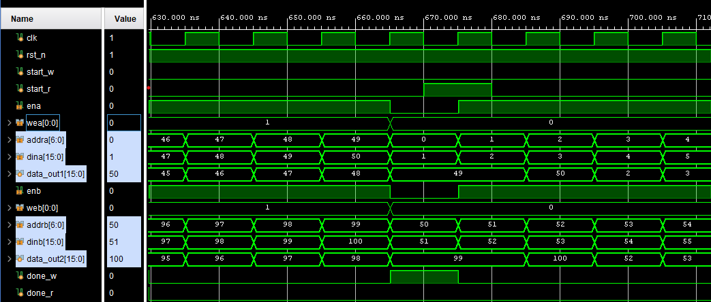
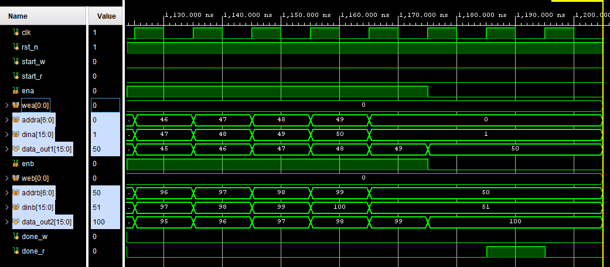

# true dual port ram
SangJae Park
2026-07-28

## Overview
- instance true dual port ram & read data
- this is ETRI W6 DAY 2 ASSIGNMENT3.

## Features


## Constraints
- read delay is 2 clk cycles
- addr is 0 to 99
- data input is interner register and the data is 1 to 100

- write at Port A (addra  0 to 49) and read it
- writa at Port B (addrb 50 to 99) and read it
- reset is async active low
- done_w is 1 clk pulse after WRITE
- done_r is 1 clk pulse after READ
## Interface
```sv
        input   logic               clk
    ,   input   logic               rst_n
    ,   input   logic               start_w
    ,   input   logic               start_r

    ,   output  logic [15:0]        data_out1 // for port a
    ,   output  logic [15:0]        data_out2 // for port b
    ,   output  logic               done_w
    ,   output  logic               done_r
```

## Block diagram
### bd_top

s
### bd_true_dual_port_ram

- port name mistake `wena` => `wea`
## Registers
```sv
logic [6:0]         addra, addrb;
logic [15:0]        dina, dinb;
logic               ena, enb;
logic               wea, web;
```

## RAM if
read  : addr       +  we + en (1clk cycle hold)=> write
write : addr + din + !we + en (2clk cycle hold)=> read
- primitives output register(so read need 2 more cycle)
- read is 1 more clk needed for en
- and then read is 1 more clk for done
- write first => dout = dina return after latency
- read first  => dout = ram[addr] before write
- no_change   => dout hold

this module is `write first`.
```sv
blk_mem_gen_0 u_blk_mem_gen_0 (
    .clka   (clk),
    .ena    (ena),
    .wea    (wea),
    .addra  (addra),
    .dina   (dina),
    .douta  (data_out1),
    .clkb   (clk),
    .enb    (enb),
    .web    (web),
    .addrb  (addrb),
    .dinb   (dinb),
    .doutb  (data_out2),
);
```

## timing diagram
### WRITE START
```wavedrom

{head: { text: "write_ start" }
,   signal : [
    ['input'
    ,   {name : "clk",     wave : "P......."}
    ,   {name : "start_w",   wave : "010....."}
    ,   {name : "start_r",   wave : "0......."}
    ]
  	,	{}
    ,['mem'
    ,   {name : "wea",     wave : "x01....."}
    ,   {name : "ena",     wave : "x01....."}
    ,   {name : "addra",   wave : "x.======", data : ["0","1","2","3","4","5"]}
    ,   {name : "dina",    wave : "x.======", data : ["1","2","3","4","5","6"]}
	,   {name : "douta",   wave : "x...====", data : ["1","2","3","4","5","6"]}
    ,	{}  
    ,   {name : "web",     wave : "x01....."}
    ,   {name : "enb",     wave : "x01....."}
    ,   {name : "addrb",   wave : "x.======", data : ["50","51","52","53","54","55"]}
    ,   {name : "dinb",    wave : "x.======", data : ["51","52","53","54","55","56"]}
	,   {name : "doutb",   wave : "x...====", data : ["51","52","53","54","55","56"]}
    ]
  	,	{}
,   ['output'    
    ,   {name : "done_r",  wave : "0......."}
    ,   {name : "done_w",  wave : "0......."}
    ]
]
}
```
### WRITE READ
```wavedrom

{head: { text: "WRITE_READ" }
,   signal : [
    ['input'
    ,   {name : "clk",     wave : "P......."}
    ,   {name : "start_w",   wave : "0......."}
    ,   {name : "start_r",   wave : "0......."}
    ]
  	,	{}
    ,['mem'
    ,   {name : "wea",     wave : "1..0...."}
    ,   {name : "ena",     wave : "1......."}
    ,   {name : "addra",   wave : "========", data : ["47","48","49","0","1","2","3","4"]}
    ,   {name : "dina",    wave : "====....", data : ["48","49","50","0"]}
	,   {name : "douta",   wave : "========", data : ["46","47","48","49","50","1","2","3"]}
    ,	{}  
    ,   {name : "web",     wave : "1..0...."}
    ,   {name : "enb",     wave : "1......."}
    ,   {name : "addrb",   wave : "========", data : ["97","98","99","50","51","52","53","54"]}
    ,   {name : "dinb",    wave : "====....", data : ["98","99","100","0"]}
	,   {name : "doutb",   wave : "========", data : ["96","97","98","99","100","51","52","53"]}
    ]
  	,	{}
,   ['output'    
    ,   {name : "done_r",  wave : "0......."}
    ,   {name : "done_w",  wave : "0..10..."}
    ]
]
}
```

### READ DONE
```wavedrom

{head: { text: "READ_DONE" }
,   signal : [
    ['input'
    ,   {name : "clk",     wave : "P......."}
    ,   {name : "start_w",   wave : "0......."}
    ,   {name : "start_r",   wave : "0......."}
    ]
  	,	{}
    ,['mem'
    ,   {name : "wea",     wave : "0......."}
    ,   {name : "ena",     wave : "1......."}
    ,   {name : "addra",   wave : "====....", data : ["47","48","49","0","1","2","3","4"]}
    ,   {name : "dina",    wave : "=.......", data : ["0"]}
	,   {name : "douta",   wave : "======..", data : ["46","47","48","49","50","1","2","3"]}
    ,	{}  
    ,   {name : "web",     wave : "0......."}
    ,   {name : "enb",     wave : "1......."}
    ,   {name : "addrb",   wave : "====....", data : ["97","98","99","50","1","2","3","4"]}
    ,   {name : "dinb",    wave : "=.......", data : ["50"]}
	,   {name : "doutb",   wave : "======..", data : ["96","97","98","99","100","1","2","3"]}
    ]
  	,	{}
,   ['output'    
    ,   {name : "done_r",  wave : "0....10."}
    ,   {name : "done_w",  wave : "0......."}
    ]
]
}
```
## state
write : WIDLE--start_w-->WRITE--(addra == 49)-->WDONE-->WIDLE
read  : RIDLE--start_r-->READ --(addra == 49)--> R_WAIT_DATA--1clk-->R_WAIT_DONE --1clk--> RDONE -- 1CLK --> RIDLE

```mermaid
stateDiagram-v2
    state "WRITE FSM" as Write {
        WIDLE --> WRITE : start_w / addra = 0
        WRITE  --> WRITE : addra < 49
        WRITE  --> WDONE : addra == 49
        W_DONE --> WIDLE  : done_w pulse
    }
    state "Read FSM" as READ {
        [*] --> RIDLE
        RIDLE --> READ : start_r / addra=0
        READ --> READ : addra < 49
        READ --> R_WAIT_DATA : addra == 50
        R_WAIT_DATA --> R_WAIT_DONE : last data valid
        R_WAIT_DONE --> RDONE : 1clk
        RDONE --> RIDLE : done_r pulse
    }
```

## Test
### Test scenario
1. repeat(15) @posedge clk; // po sim때문에 10클럭 넘기고 수행
2. reset
3. start
4. wait(done)

### be_sim
#### be_sim_write_start

---
#### be_sim_write_read

---
#### be_sim_read_done

---
### po_sim
#### po_sim_write_start

---
#### po_sim_write_read

---
#### po_sim_read_done

---

## Trouble shooting
